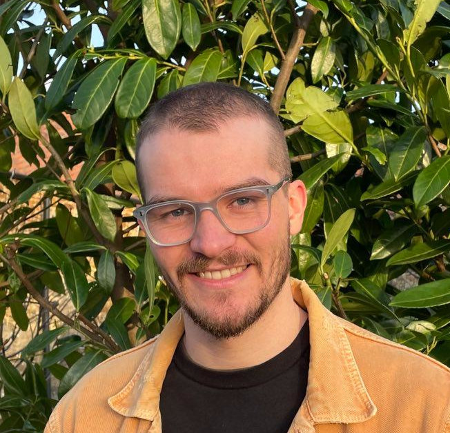

{:style="display: block; width: 300px; border-radius: 50%, height:auto; margin-left: auto; margin-right:40px; float: left; clear:left;"}

I am a postdoc in the group of [Prof Gian-Marco Rignanese](https://perso.uclouvain.be/gian-marco.rignanese/) at UCLouvain, working on machine learning and high-throughput workflows for computational materials science. I'm also writing up my thesis as a PhD student at the University of Cambridge, supervised by [Dr Andrew Morris](http://www.andrewjmorris.org), working on crystal structure prediction for energy storage materials. 

My CV is available at [ml-evs.science/cv](https://ml-evs.science/cv) and most of my software work can be found on [GitHub](https://github.com/ml-evs).
